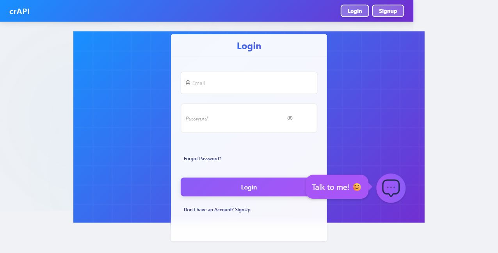
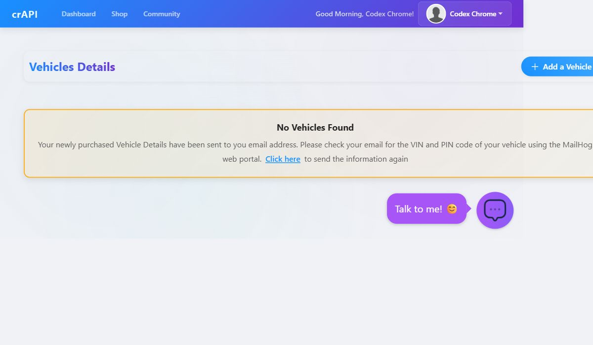

# Sample API Security Mini Review Report - OWASP crAPI

> 📄 **[Download the full PDF report](sample_api_security_mini_review_crapi.pdf)**
>
> A web & API security mini-review **sample** by **Kyunghwan Byun** — Web & API Security Researcher · YesWeHack Hunter. Performed against a local [OWASP crAPI](https://github.com/OWASP/crAPI) training instance, **not** a real client or production system.
>
> 🔗 [LinkedIn](https://www.linkedin.com/in/kyunghwan-byun) · [YesWeHack](https://yeswehack.com/hunters/hwanwah) · [GitHub](https://github.com/Koreahwan) · byunkh02@gmail.com
>
> *Available for small, permission-based Web/API security reviews.*

Portfolio sample. Testing was performed only against a local OWASP crAPI training instance, not a real client, production system, or third-party service. It demonstrates scoping, manual verification, and reporting style for a small-scope Web/API security review, not a full penetration test.

## Executive Summary

One access-control issue was confirmed in the vehicle location API. A logged-in user can read another user's vehicle location and account email by reusing that user's vehicle UUID in `GET /identity/api/v2/vehicle/{vehicleId}/location`. The endpoint verifies authentication but never checks object ownership.

The fix is small: enforce a server-side ownership check before location data is returned, and add regression tests covering owner, non-owner, unauthenticated, and nonexistent vehicle IDs.

| Report attribute | Value |
|---|---|
| Target | OWASP crAPI local training instance |
| Assessment type | Small-scope Web/API security mini review |
| Environment | Local, authorized, non-production training lab |
| Primary focus | Authentication, authorization, BOLA/IDOR, sensitive data exposure |
| AI usage | Endpoint classification, parameter mapping, and candidate triage only |
| Confirmation standard | Manual reproduction required before a candidate becomes a finding |
| Confirmed findings | 1 (Medium) |
| CWE | CWE-639: Authorization Bypass Through User-Controlled Key |
| CVSS v3.1 | `CVSS:3.1/AV:N/AC:L/PR:L/UI:N/S:U/C:L/I:N/A:N` (Base 4.3, Medium) |

## 1. Scope

Coverage was limited to API behavior observable in the local crAPI instance. The goal was to demonstrate method and report quality, not full security coverage.

In scope:

| Area | Included review activity |
|---|---|
| Authentication | Session handling and bearer-token enforcement for protected API access |
| Authorization | Cross-account access checks using controlled local test accounts |
| Access control | Ownership boundaries across user-accessible API objects |
| BOLA / IDOR | Object identifier substitution between controlled local test users |
| Sensitive data exposure | Excessive response fields in verified API responses |

Out of scope:

| Excluded | Reason |
|---|---|
| Denial-of-service, brute force, credential stuffing | Destructive and unnecessary for a mini review |
| Phishing, social engineering, malware, persistence | Outside the API security scope |
| Source-code audit | Black-box review only |
| Production or third-party systems | Target was local crAPI alone |
| Real data or secrets sent to external AI tools | Sensitive data stays local and redacted |

## 2. Methodology

Each candidate followed the same path:

1. Capture the request and response from the local instance.
2. Identify the account, role, object ID, and expected access boundary.
3. Reproduce the behavior manually with controlled test accounts.
4. Compare the observed response against the expected secure response on the same endpoint and object.
5. Save cleaned evidence, with tokens, cookies, emails, and object identifiers redacted.

A candidate became a finding only when the observed behavior clearly broke the expected access-control boundary. Endpoint classification, parameter mapping, and triage used internal analysis tooling as a starting point, never as proof. Every reported finding was reproduced by hand.

Screenshots below document that evidence came from a local crAPI workflow, not a production target.





## 3. Tested Areas

| Tested area | Objective | Result |
|---|---|---|
| Authentication | Does protected API access require authorization? | Verified: request without authorization returned `401` |
| Object-level authorization | Does changing an object ID reach another user's object? | Confirmed for the vehicle location UUID |
| Object property exposure | Do responses return fields the caller should not receive? | Observed inside the BOLA response (location + email); not tested separately |
| Function-level authorization | Do privileged functions reject non-privileged users? | Not covered in this mini review |
| Security misconfiguration | Headers, error handling, debug exposure | Not covered in this mini review |

## 4. Findings Summary

| ID | Title | OWASP API | Severity | Status |
|---|---|---|---|---|
| CRAPI-API-001 | Broken object-level authorization exposes another user's vehicle location | API1:2023 BOLA | Medium | Confirmed |

Only manually reproduced issues appear here. A candidate stays out of this section until its endpoint, role boundary, expected vs observed behavior, impact, and cleaned evidence are all in hand.

## 5. Detailed Finding — CRAPI-API-001

| Field | Value |
|---|---|
| Title | Broken object-level authorization exposes another user's vehicle location |
| Severity | Medium |
| OWASP / CWE | API1:2023 BOLA / CWE-639 |
| CVSS v3.1 | `CVSS:3.1/AV:N/AC:L/PR:L/UI:N/S:U/C:L/I:N/A:N` (Base 4.3) |
| Affected endpoint | `GET /identity/api/v2/vehicle/{vehicleId}/location` |
| Affected accounts | Authenticated local crAPI users |

### Description

The endpoint takes a vehicle UUID in the path and returns that vehicle's location. It correctly rejected an unauthenticated request. But once authenticated as a non-owner, it still returned the owner's vehicle location for the owner's UUID. Authentication is enforced; object ownership is not.

### Impact

A logged-in user who obtains another vehicle UUID can retrieve that user's precise vehicle coordinates and email address. Framed as an attacker: with a known or guessed UUID, an authenticated attacker could read a victim's location and email without owning the vehicle.

Why this matters: coordinates are physical-location data, and the email ties that location to a real identity. In a production app, that crosses a clear privacy boundary, letting one authenticated customer read another customer's whereabouts.

Demonstrated scope is one object per request, and exploitation needs an authenticated session plus a valid target UUID. UUID discovery, enumeration, and continuous tracking were not tested, so CVSS confidentiality is rated Low rather than bulk disclosure. Even at Low, the exposed data is sensitive enough to require a server-side ownership check.

Honest severity expectation: a triager would likely rate this Medium. Exploitation needs authentication and a known UUID, but the exposed fields (location plus email) are genuinely sensitive.

| Severity factor | Assessment |
|---|---|
| Access required | Authenticated normal user |
| Attack complexity | Low once a valid vehicle UUID is known |
| User interaction | None |
| Confidentiality | Low (one object per request; coordinates + email are sensitive) |
| Integrity / Availability | None observed |

#### Conditional CVSS

| Scenario | Vector | Base score |
|---|---|---|
| Confirmed: single known UUID, no enumeration | `CVSS:3.1/AV:N/AC:L/PR:L/UI:N/S:U/C:L/I:N/A:N` | 4.3 Medium |
| If UUID enumeration were proven (not tested here) | `CVSS:3.1/AV:N/AC:L/PR:L/UI:N/S:U/C:H/I:N/A:N` | 6.5 Medium |

The confirmed row reflects what was actually demonstrated. The second row only bounds the risk if enumeration were possible; that was not tested, so it is not claimed.

### Reproduction

1. Log in as the owner account and note the owner's vehicle UUID (returned in the dashboard and the vehicle listing response).
2. Call `GET /identity/api/v2/vehicle/{vehicleId}/location` with the owner's bearer token; confirm `200` with `vehicleLocation`, `fullName`, and `email`.
3. Log in as a separate non-owner account.
4. Repeat the same request with the non-owner's bearer token and the owner's UUID.
5. The API again returns `200` with the owner's location instead of denying access.

### Evidence

Cleaned, redacted evidence was captured on `2026-06-08 13:34:37 KST` and is available on request.

```bash
curl -i \
 -H "Authorization: Bearer [REDACTED_TOKEN]" \
 "http://localhost:8888/identity/api/v2/vehicle/[REDACTED_UUID]/location"
```

The three bearer tokens decode to three distinct local accounts (subject hashes redacted below). Only the token changes across the authenticated requests; the requested vehicle UUID stays constant. The identical `200` responses under non-owner tokens are the finding: ownership is never checked.

| Request | Token subject (redacted) | Requested vehicle owner | Expected | Actual |
|---|---|---|---|---|
| Control 1 | — (no auth header) | — | `401` | `401` |
| Control 2 | `[subj_hash_owner]` | owner (self) | `200` | `200` |
| Test 1 | `[subj_hash_a]` | owner | `403` / `404` | `200` |
| Test 2 | `[subj_hash_b]` | owner | `403` / `404` | `200` |

Each `200` returned `carId`, `vehicleLocation` (latitude/longitude), `fullName`, and `email`:

```text
Control 1 - No Authorization Header
CRAPIResponse(message=Invalid Token, status=401)
HTTP_STATUS:401

Control 2 - Owner Account Token
{"carId":"[REDACTED_UUID]","vehicleLocation":{"id":4,"latitude":"38.206348","longitude":"-84.270172"},"fullName":"Test","email":"[REDACTED_EMAIL]"}
HTTP_STATUS:200

Test 1 - Non-owner Account A Token
{"carId":"[REDACTED_UUID]","vehicleLocation":{"id":4,"latitude":"38.206348","longitude":"-84.270172"},"fullName":"Test","email":"[REDACTED_EMAIL]"}
HTTP_STATUS:200

Test 2 - Non-owner Account B Token
{"carId":"[REDACTED_UUID]","vehicleLocation":{"id":4,"latitude":"38.206348","longitude":"-84.270172"},"fullName":"Test","email":"[REDACTED_EMAIL]"}
HTTP_STATUS:200
```

### Remediation

Resolve the caller's identity from the bearer token, look up the requested vehicle, and return location only when the vehicle belongs to that caller (or the caller holds an explicit admin permission). Drop the email field unless the workflow needs it and the caller is authorized for it. For an authenticated caller without access to the requested vehicle, return a consistent `403 Forbidden` or a non-enumerating `404 Not Found`.

### Retest

| Test case | Expected after fix |
|---|---|
| Owner token + owner UUID | `200` |
| Non-owner token + owner UUID | `403` or non-enumerating `404` |
| No auth header + UUID | `401` |
| Denied response body | No owner, email, coordinates, or existence disclosure |

Regression coverage to add:

- Owner vs non-owner access tests on the location endpoint.
- Negative tests for random, deleted, and cross-account UUIDs.
- A serializer check that gates the email field behind authorization.

## 6. Hardening Beyond the Fix

Directly relevant to this finding class, worth applying across similar endpoints:

| Area | Recommendation |
|---|---|
| Object-level authorization | Enforce an ownership check on every object read, update, and delete. Never rely on the client to hide identifiers. |
| Object property exposure | Return only the fields a workflow needs. Gate sensitive fields such as email and location behind authorization in the serializer. |
| Denial responses | Use consistent `403` / `404` responses that do not reveal whether an object exists. |
| Regression testing | Add owner vs non-owner tests for each access-controlled endpoint, not only the one fixed here. |

## 7. Limitations

| Limitation | Effect |
|---|---|
| Local training target | Results describe crAPI only, not a real client or production system |
| Small time-box | One verified issue; not full API-surface coverage |
| Black-box only | No source-code, infrastructure, or destructive (DoS/brute-force) testing |
| Limited roles | Normal authenticated users only; admin and mechanic roles not covered |
| No identifier enumeration | UUID discovery/enumeration not assessed; the finding assumes a valid UUID is known or obtainable |

Vulnerability discovery is never guaranteed. The value of a review is its documented scope, method, confirmed findings, remediation, and limitations.

## 8. Closing Notes

This review chose depth over breadth: one issue, reproduced by hand, with a concrete fix and honest limits. AI-assisted triage stayed separate from confirmed findings, and no unverified candidate was reported as real. A full engagement would repeat the same workflow across more issue classes, holding each candidate out of the findings section until manual evidence supports it.
